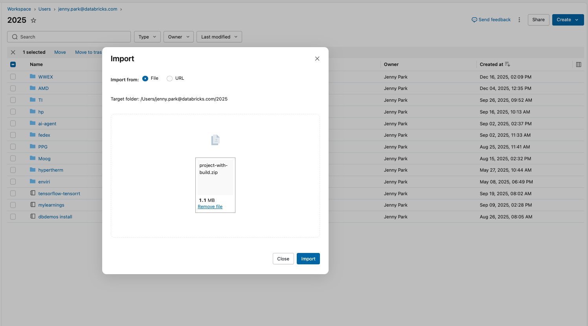
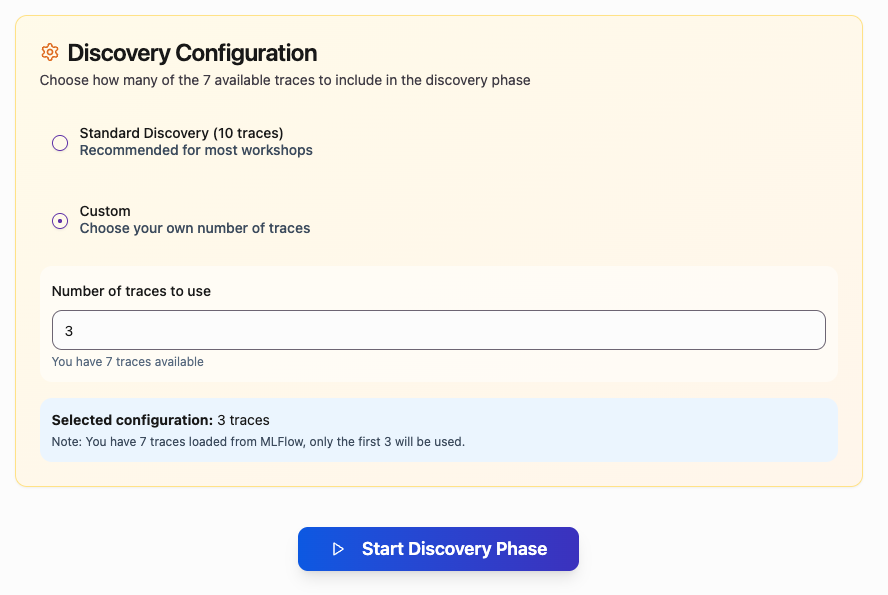
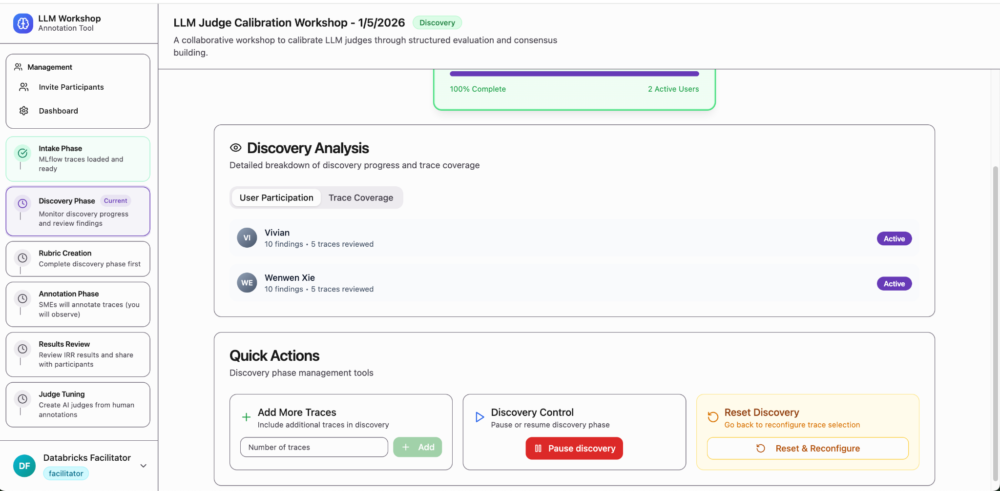
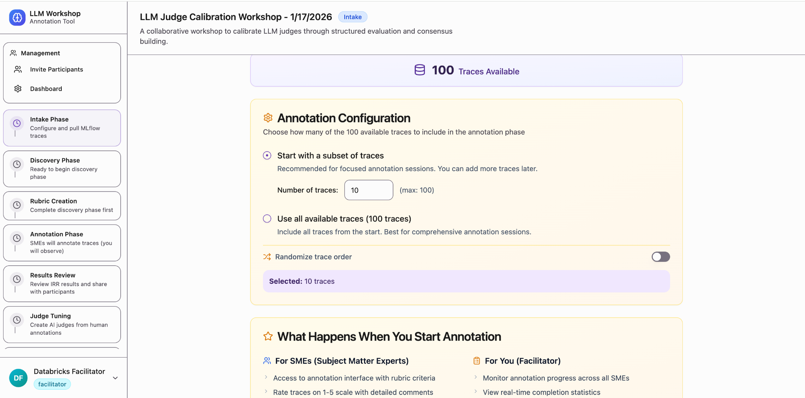
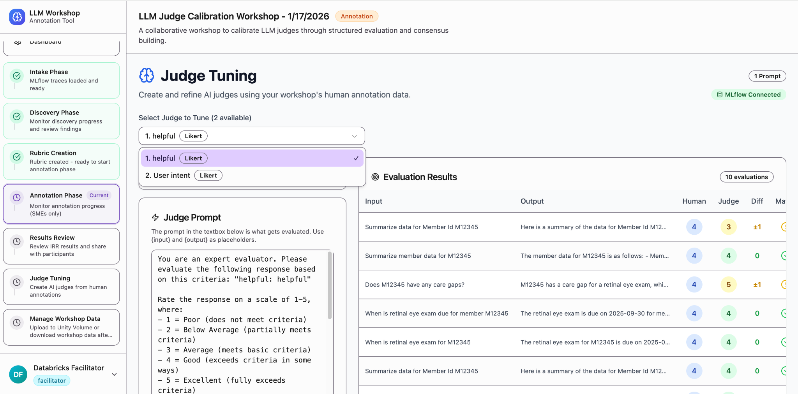

# Judge Builder Workshop - Facilitator Guide

A comprehensive guide for facilitators to deploy, configure, and run the LLM Judge Calibration Workshop application on Databricks.

---

## Table of Contents

1. [Requirements](#requirements)
2. [Workshop Outcomes](#workshop-outcomes)
3. [Facilitator's Role](#facilitators-role)
4. [Part 1: Deploying the Application](#part-1-deploying-the-application)
5. [Part 2: Managing Participants](#part-2-managing-participants)
6. [Part 3: Intake Phase](#part-3-intake-phase)
7. [Part 4: Discovery Phase](#part-4-discovery-phase)
8. [Part 5: Rubric Creation](#part-5-rubric-creation)
9. [Part 6: Annotation Phase](#part-6-annotation-phase)
10. [Part 7: Results Review](#part-7-results-review)
11. [Part 8: Judge Tuning](#part-8-judge-tuning)
12. [Part 9: Data Management](#part-9-data-management)
13. [FAQ](#faq)

---

## Requirements

Before starting the workshop, ensure you have:

- [ ] **At least 2 participants** to provide annotations (required for Judge Alignment)
- [ ] **At least 10 traces** to enable alignment
- [ ] Access to a Databricks workspace
- [ ] MLflow experiment with traces (if using MLflow ingestion)
- [ ] Databricks personal access token

---

## Workshop Outcomes

By the end of this workshop, you will have:

- **A calibrated LLM judge** (or multiple judges) tailored to your specific use case
- **Labeled data** generated during the data annotation process
- **A repeatable process** you can scale across all your high-value use cases

---

## Facilitator's Role

As the facilitator, you are **not annotating like an SME**. Your responsibilities are to:

- Configure the workshop
- Control phase transitions
- Facilitate discussion to reach consensus
- Monitor progress and participation
- Turn human judgments into a calibrated LLM judge

---

## Part 1: Deploying the Application

### Step 1: Download the Project

1. Go to [https://github.com/databricks-solutions/project-0xfffff/releases/tag/v1.1.0](https://github.com/databricks-solutions/project-0xfffff/releases/tag/v1.1.0)

2. Click to download **`project-with-build.zip`**

   > ⚠️ **IMPORTANT:** Make sure to click `PROJECT_WITH_BUILD.ZIP` file. Ignore the Source code zip files.

### Step 2: Import into Databricks Workspace

1. Go to **Workspace** in Databricks
2. Click the **three dots** next to Share
3. Select **Import**
4. Drag and drop `project-with-build.zip`
5. Click **Import**



### Step 3: Verify the Import

1. Click into **project-0xfffff**
2. Navigate to the **client** folder
3. Verify that the **build** folder is present

### Step 4: Create the App

1. Navigate to **Compute** → **Apps**
2. Click **Create App**
3. Select **Create a custom app**
4. Enter your app name (e.g., `judge-builder-workshop`)
5. Click **Create App**

### Step 5: Deploy the App

1. Once the app is created, click **Deploy**
2. In the "Create deployment" popup, click the folder icon
3. Select **project-0xfffff** as the source folder
4. Click **Deploy**


### Step 6: Access the App

1. Wait for the deployment to complete
2. Once the app shows **Running** status, click the link next to it
3. 🎉 **Congratulations!** The app is deployed successfully!

---

## Part 2: Managing Participants

Navigate to: **Facilitator Dashboard** → **Add New User / Workshop Users**

### Adding Users

1. Enter the user's **Email**
2. Enter the user's **Full Name**
3. Select the **Role**:
   - **SME** → Provides discovery feedback AND annotates during Annotation Phase
   - **Participant** → Provides discovery feedback only
4. Click **Add User**


### Verification Checklist

- [ ] All users show **Active** status
- [ ] Correct role distribution (at least 2 SMEs recommended)
- [ ] User breakdown shows expected counts

---

## Part 3: Intake Phase

The Intake Phase is where you get data into the workshop.

### Option A: MLflow Trace Intake

#### Step 1: Configure MLflow Connection

Fill in the MLflow configuration:

| Field | Description |
|-------|-------------|
| **Databricks Host** | Your workspace URL (e.g., `https://adb-xxx.azuredatabricks.net`) |
| **Experiment ID** | The MLflow experiment containing your traces |
| **Databricks Token** | Your personal access token |
| **Max Traces** | Number of traces to import (recommend **10** to start) |
| **Filter String** | Optional filter (e.g., `attributes.status = 'OK'`) |

#### How to Find the Experiment ID

1. Go to **Serving** in Databricks
2. Select the model serving endpoint containing your traces
3. Click the **model version** (e.g., Version 1)
4. This takes you to the registered model in Unity Catalog
5. Click the **Source Run** under "About this version"
6. Copy the **Experiment ID** from the URL


#### Step 2: Ingest Traces

1. Click **Ingest Traces from MLflow**
2. Verify the Intake Status shows:
   - ✅ Configured
   - ✅ Ingested
   - Correct trace count


### Option B: Upload CSV

If MLflow access isn't available:

1. Prepare a CSV with `request_preview` and `response_preview` columns
2. Click **Select CSV File**
3. Choose import destination:
   - **Import directly into Discovery** - Add traces for immediate use
   - **Log to MLflow as traces** - Create MLflow traces for later import
4. Click **Upload to Discovery**

### Reset Option

If the data is incorrect, use **Delete All & Reset Workshop** to start over.

---

## Part 4: Discovery Phase

In this phase, participants explore traces and provide qualitative feedback to inform the rubric.

### Starting Discovery

1. Go to the **Discovery Phase**
2. Choose your configuration:
   - **Standard Discovery (10 traces)** - Randomly selects traces; participants may get different subsets
   - **Custom** - Choose a specific number of traces; all participants see the same traces
3. Optional: Enable **Randomize trace order** (OFF by default)
4. Click **Start Discovery Phase**
5. Give participants time to provide feedback (e.g., 10 minutes)



### Monitoring Progress

Track the following metrics:

- **% Completion** - Overall progress
- **Active Users** - Who is currently participating
- **Trace Coverage** - Are all traces being reviewed?



### Quick Actions

| Action | When to Use |
|--------|-------------|
| **Add More Traces** | Discussion is shallow, need more examples |
| **Pause Discovery** | Need group discussion |
| **Reset & Reconfigure** | Traces are poor quality |

### What Participants Are Doing

Participants will:
- Review traces (input/output pairs)
- Write qualitative feedback on strengths and weaknesses
- Identify edge cases

---

## Part 5: Rubric Creation

Convert discovery insights into structured evaluation criteria.

### Facilitator Workflow

1. **Review participant responses** to identify patterns
   - Look for repeated strengths, weaknesses, and disagreements

2. **Facilitate discussion** using concrete examples
   - Use specific traces and comments to surface differing interpretations

3. **Capture emerging quality signals**
   - Record key insights in the scratch pad

4. **Translate insights into rubric criteria**
   - Create clear, consistent evaluation questions

### Creating Evaluation Criteria

For each criterion, configure:

| Setting | Options |
|---------|---------|
| **Question Title** | Clear, descriptive name (e.g., "User Intent", "Response Accuracy") |
| **Question Description** | Precise explanation of what to evaluate |
| **Evaluation Type** | Likert (1-5 scale), Binary (Pass/Fail), or Free-form |


### Example Criteria

- **User Intent**: Does the response align with user intent?
- **Response Accuracy**: Is the information factually correct?
- **Completeness**: Does the response fully address the question?
- **Business Relevance**: Is the response appropriate for the use case?

---

## Part 6: Annotation Phase

SMEs apply the rubric to label traces. As facilitator, you observe but do not label.

### Configuration

1. Go to the **Annotation Phase**
2. Choose trace selection:
   - **Start with a subset** - Recommended for focused sessions
   - **Use all available traces** - For comprehensive annotation
3. Optional: Enable **Randomize trace order**
4. Click **Start Annotation**
5. Give SMEs time to annotate (e.g., 5 minutes)



### Monitoring

Track:
- Traces annotated (e.g., 3/10)
- Participation per SME
- Rating distribution

> ⚠️ **Important:** Do not influence ratings mid-stream unless there's confusion about the rubric.

### What SMEs Are Doing

SMEs will:
- Rate each trace using the rubric criteria
- Optionally add reasoning for their ratings


### Quick Actions

- **Add More Traces** - Include additional traces for annotation
- **Judge Name** - Set the name for MLflow feedback entries
- **Pause Annotation** - Temporarily halt the annotation phase

---

## Part 7: Results Review

Diagnose disagreement between annotators using Inter-Rater Reliability (IRR) metrics.

### Understanding Krippendorff's Alpha

| Alpha Value | Interpretation |
|-------------|----------------|
| **< 0** | Systematic disagreement |
| **~0** | Random agreement (no reliability) |
| **0.6+** | Acceptable alignment |
| **0.8+** | Good alignment |

### Review Process

1. **Review IRR per criterion** - Identify which criteria have low agreement
2. **Read Identified Issues** - See specific traces with disagreement
3. **Lead discussion** with SMEs:
   - "Why did we disagree here?"
   - "What interpretation differed?"


### Addressing Low Agreement

| Issue | Action |
|-------|--------|
| Ambiguous rubric | Clarify wording |
| Missing context | Add examples/counterexamples |
| Too complex | Simplify or split criteria |
| Interpretation differences | Re-annotate a subset |

---

## Part 8: Judge Tuning

Transform human annotations into a calibrated LLM judge.

### Prerequisites

- ✅ At least 10 SME-annotated traces
- ✅ At least 2 annotators

### Configuration

1. Select **Evaluation LLM** (e.g., GPT-5.1)
2. Select **Alignment LLM** (for SIMBA optimizer)
3. Verify **Judge Name** (set in Annotation Phase)

### Running Evaluation and Alignment

1. **Run `evaluate()`** - Establishes baseline judge performance
2. **Run `align()`** - Optimizes judge prompt against human labels



### Tuning Multiple Judges

Use the **"Select Judge to Tune"** dropdown to tune judges for each evaluation criterion one by one.

### Execution Logs

Monitor the logs for:
- Baseline mini-batch scores
- Processing bucket information
- Optimization progress

---

## Part 9: Data Management

Export workshop data for further processing or analysis.

### Options

| Method | Description |
|--------|-------------|
| **Upload to Unity Volume** | Store in Unity Catalog for team access |
| **Download Database** | Download complete workshop database locally |

### Unity Volume Upload

1. Enter the **Volume Path** (e.g., `catalog.schema.volume_name`)
2. The filename is auto-generated
3. Click **Upload to Unity Volume**

### Local Download

1. Click **Download Workshop Database**
2. The `.db` file includes all traces, annotations, rubric data, and configuration


---

## FAQ

### Which LLM judge should I use for evaluation?

Use a **strong reasoning model** for evaluation. For alignment, GPT-5.1 has shown better results (as of 12/19/2025), though this hasn't been quantified compared to Sonnet.

### What is "baseline mini-batch" in the execution logs?

The baseline mini-batch score represents the judge score compared to human-annotated scores. Each bucket represents a mini-batch of data.

### Why does my prompt look the same after running alignment?

If there isn't much disagreement between the LLM judge and human annotations, the alignment process has fewer differences to learn from. Alignment creates a new prompt to bridge the gap between LLM and human judgments—if the gap is small, changes will be minimal.

### What's the difference between Standard Discovery and Custom?

- **Standard Discovery**: Randomly ingests traces; each participant may get different subsets
- **Custom**: All participants see the same traces, ensuring consistent coverage

### How do I close out a workshop?

The ideal outcome is a skeletal version that produces a notebook containing:
- `evaluate()` results
- `align()` results
- Scorer configuration
- Prompt optimization output

---

## Quick Reference: Workshop Flow

```
┌─────────────────┐
│   1. Deploy     │
│   Application   │
└────────┬────────┘
         ▼
┌─────────────────┐
│  2. Add Users   │
│  (SMEs/Participants) │
└────────┬────────┘
         ▼
┌─────────────────┐
│  3. Intake      │
│  (Ingest Traces)│
└────────┬────────┘
         ▼
┌─────────────────┐
│  4. Discovery   │
│  (Explore Data) │
└────────┬────────┘
         ▼
┌─────────────────┐
│  5. Rubric      │
│  (Create Criteria) │
└────────┬────────┘
         ▼
┌─────────────────┐
│  6. Annotation  │
│  (Label Traces) │
└────────┬────────┘
         ▼
┌─────────────────┐
│  7. Results     │
│  (Review IRR)   │
└────────┬────────┘
         ▼
┌─────────────────┐
│  8. Judge Tuning│
│  (Calibrate LLM)│
└────────┬────────┘
         ▼
┌─────────────────┐
│  9. Export Data │
│  (Save Results) │
└─────────────────┘
```

---

## Support

Need help? Contact your Databricks representative or workshop coordinator.
